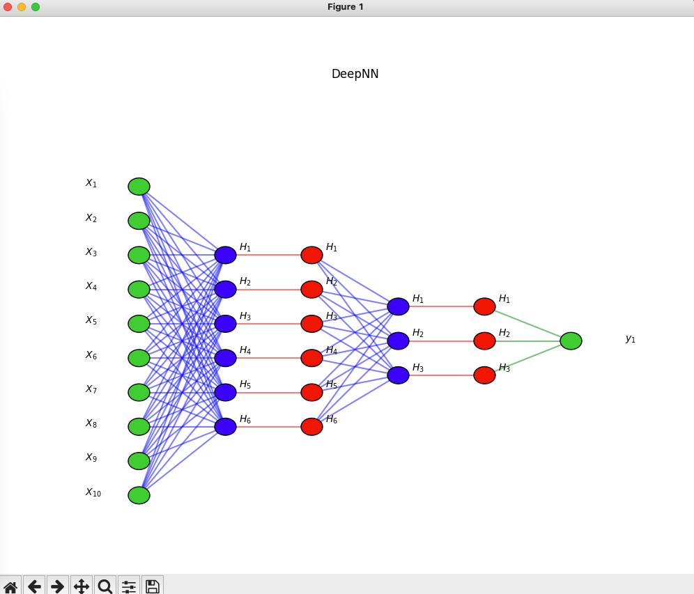
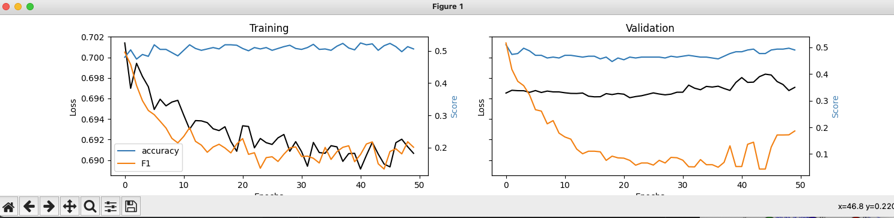
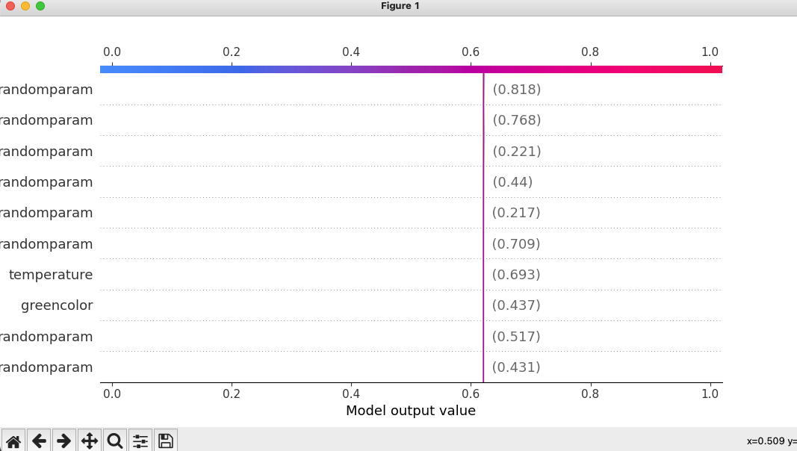

This is very base version of the diploma work.

It's represent the Depp Learning Algorith with using of 4 layer neural-networks.
(input-hidden-hidden-output)

2 hidden layers use relu activation function, and the output layer use the sigmoid.

***
Get started:
1. Install the PyCharm IDE
2. Clone the repository
3. Install required dependencies: 
```bash
pip install tensorflow
pip install matplotlib
pip install shap
```
***
Run code:
1. run "main" function

    Expected: The model representation, 10 input parameters, 2 hidden layers


2. close the shown window

    Expected: The model training results. Accuracy and validation

3.  close the shown window
    
    Expected: the every param weight for the random data from training set

4.  See the console output for the details:
    
    Expected:
```
Model: "DeepNN"
_________________________________________________________________
 Layer (type)                Output Shape              Param #   
=================================================================
 h1 (Dense)                  (None, 6)                 66        
                                                                 
 drop1 (Dropout)             (None, 6)                 0         
                                                                 
 h2 (Dense)                  (None, 3)                 21        
                                                                 
 drop2 (Dropout)             (None, 3)                 0         
                                                                 
 output (Dense)              (None, 1)                 4         
                                                                 
=================================================================
Total params: 91
Trainable params: 91
Non-trainable params: 0
_________________________________________________________________
predict for
[[0.42589432 0.14551832 0.68141886 0.12647326 0.88931378 0.86280435
  0.94223384 0.82409329 0.37947715 0.21302587]]
1/1 [==============================] - 0s 68ms/step
[[0.47959748]]
```